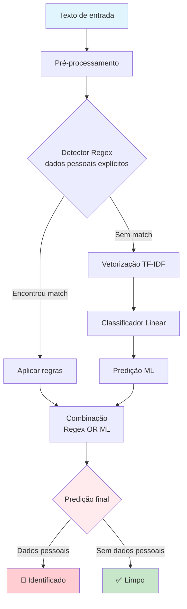

# Projeto PrivacyAware

Objetivo do projeto:

Classificar pedidos de acesso à informação em:

* **1 = contém dados pessoais**
* **0 = não contém**

Maximizando **F1-score**, com **ênfase em recall** (minimizar falsos negativos).

---
## 🎯 Objetivo do pipeline

* ✔️ Maximizar recall 
* ✔️ Simples de explicar 
* ✔️ Fácil de rodar e reproduzir
* ✔️ Não depender de LLM, GPU ou APIs externas
* ✔️ Robustez > sofisticação

---

## 🧠 Estratégia geral (o pulo do gato)

**Pipeline híbrido**:

1. **Regras determinísticas (regex)** → capturam casos óbvios
2. **Modelo estatístico simples (ML clássico)** → pega padrões não explícitos
3. **OR lógico final** → se *qualquer* um detectar → classifica como positivo

