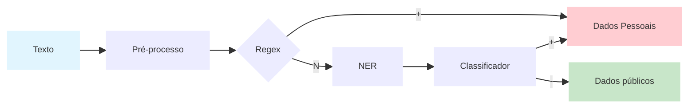

# Projeto PrivacyAware

---

## 🎯 Objetivo do projeto:

Classificar pedidos de acesso à informação em:

* **1 = contém dados pessoais**
* **0 = não contém**

Maximizando **F1-score**, com **ênfase em recall** (minimizar falsos negativos).

---

### ▶️ Video Explicativo (clicar na imagem abaixo)

[](https://youtu.be/5qS9KVnrAiI)


---
## 🎯 Objetivo do pipeline

* ✔️ Maximizar recall 
* ✔️ Simples de explicar 
* ✔️ Fácil de rodar e reproduzir
* ✔️ Não depender de LLM, GPU ou APIs externas
* ✔️ Robustez > sofisticação

---


## 🧠 Estratégia geral

**Pipeline híbrido**:

1. **Regras determinísticas (regex)** → capturam casos óbvios
2. **Modelo NER (Named Entity Recognition)** → pega padrões não explícitos
3. **OR lógico final** → se *qualquer* um detectar → classifica como positivo



# 📦 Tutorial Completo de Instalação

Este guia vai te ensinar passo a passo como configurar e executar o projeto

---

## 📋 Entendendo a Estrutura do Projeto

Antes de começar, vamos entender o que cada arquivo faz:

```
project/
├── detector_nlu.py          # Código principal do detector de entidades
├── Dockerfile               # Instruções para criar o container Docker
├── first_names_static.py    # Lista de primeiros nomes para treinamento
├── front_app.py             # Interface web da aplicação
├── sir_name_static.py       # Lista de sobrenomes para treinamento
├── train_model.py           # Script para treinar o modelo de NER
├── requirements.txt         # Lista de dependências do projeto
├── models.zip               # Modelo pré-treinado (descompactado automaticamente)
└── logs/                    # Logs de treinamento
```

---

## 🚀 Tutorial 1 — Instalação usando Docker (Recomendado)

### O que é Docker?
Docker é como uma "máquina virtual leve" que garante que o projeto funcione igual em qualquer computador.

---

### **Passo 1: Instalar o Docker**

#### Windows:
1. Baixe o Docker Desktop: https://docs.docker.com/desktop/install/windows-install/
2. Execute o instalador
3. Reinicie o computador
4. Abra o Docker Desktop e espere iniciar

#### Mac:
1. Baixe o Docker Desktop: https://docs.docker.com/desktop/install/mac-install/
2. Arraste o Docker.app para a pasta Aplicativos
3. Abra o Docker Desktop

#### Linux (Ubuntu/Debian):
```bash
# Atualizar pacotes
sudo apt update

# Instalar Docker
sudo apt install docker.io -y

# Adicionar seu usuário ao grupo docker
sudo usermod -aG docker $USER

# Reiniciar a sessão (ou reiniciar o computador)
```

**Verificar se o Docker foi instalado:**
```bash
docker --version
```
Você deve ver algo como: `Docker version 24.0.7`

---

### **Passo 2: Clonar o Repositório**

```bash
# Navegar até a pasta onde deseja baixar o projeto
cd ~/Documents  # ou qualquer pasta de sua preferência

# Clonar o repositório (substitua pela URL correta)
git clone https://github.com/gmcaixeta/PrivacyAware.git

# Entrar na pasta do projeto
cd PrivacyAware/project
```

---

### **Passo 3: Construir a Imagem Docker**

```bash
# Certifique-se de estar na pasta project/
pwd  # deve mostrar .../project

# Construir a imagem (pode demorar 5-10 minutos na primeira vez)
docker build -t panel-spacy-app .
```

**O que está acontecendo?**
- `docker build`: comando para criar uma imagem
- `-t panel-spacy-app`: nome da imagem (você pode escolher outro)
- `.`: usar o Dockerfile da pasta atual

**Acompanhe o progresso:**
Você verá mensagens como:
```
Step 1/10 : FROM python:3.11-slim-bookworm
Step 2/10 : WORKDIR /usr/src/app
...
Successfully built abc123def456
Successfully tagged panel-spacy-app:latest
```

---

### **Passo 4: Executar a Aplicação**

```bash
docker run -p 8081:8081 panel-spacy-app
```

**O que esse comando faz?**
- `docker run`: executa um container
- `-p 8081:8081`: mapeia a porta 8081 do container para a porta 8081 do seu computador
- `panel-spacy-app`: nome da imagem que criamos

**Como saber se funcionou?**
Você verá mensagens como:
```
📦 Descompactando models.zip...
✅ Modelo descompactado com sucesso!
Bokeh app running at: http://localhost:8081
```

Abra seu navegador e acesse: **http://localhost:8081**

---


---

## 🧰 Tutorial 2 — Instalação Manual (Sem Docker)

Use este método se você não pode instalar Docker ou prefere controle total.

---

### **Passo 1: Verificar a Versão do Python**

```bash
python --version
# ou
python3 --version
```

**Você precisa do Python 3.11.x** (exemplo: 3.11.0, 3.11.5, etc.)

#### Se não tiver o Python 3.11:

**Windows:**
1. Baixe em: https://www.python.org/downloads/
2. Marque "Add Python to PATH" durante a instalação

**Mac (usando Homebrew):**
```bash
brew install python@3.11
```

**Linux (Ubuntu/Debian):**
```bash
sudo apt update
sudo apt install python3.11 python3.11-venv python3.11-pip -y
```

---

### **Passo 2: Clonar o Repositório**

```bash
cd ~/Documents
git clone https://github.com/gmcaixeta/PrivacyAware.git
cd seu-repositorio/project
```

---

### **Passo 3: Criar Ambiente Virtual**

**O que é um ambiente virtual?**
É como uma "caixa isolada" para instalar as bibliotecas do projeto sem bagunçar seu Python global.

```bash
# Criar o ambiente
python3.11 -m venv .venv

# Ativar o ambiente
# No Linux/Mac:
source .venv/bin/activate

# No Windows (PowerShell):
.venv\Scripts\Activate.ps1

# No Windows (CMD):
.venv\Scripts\activate.bat
```

**Como saber se ativou?**
Seu terminal vai mostrar `(.venv)` antes do cursor:
```
(.venv) user@computer:~/project$
```

---

### **Passo 4: Atualizar o pip**

```bash
pip install --upgrade pip
```

---

### **Passo 5: Instalar Dependências**

```bash
pip install \
  panel==1.3.8 \
  pandas==2.2.0 \
  numpy==1.26.4 \
  spacy==3.8.3 \
  spacy-lookups-data>=1.0.3
```

**No Windows, use este formato:**
```powershell
pip install panel==1.3.8 pandas==2.2.0 numpy==1.26.4 spacy==3.8.3 spacy-lookups-data>=1.0.3
```

Isso pode demorar alguns minutos.

---

### **Passo 6: Instalar Modelo SpaCy em Português**

```bash
pip install https://github.com/explosion/spacy-models/releases/download/pt_core_news_sm-3.8.0/pt_core_news_sm-3.8.0-py3-none-any.whl
```

**Verificar instalação:**
```bash
python -m spacy info pt_core_news_sm
```

Você deve ver informações sobre o modelo.

---

### **Passo 7: Executar a Aplicação**

```bash
python front_app.py
```

**Na primeira execução, você verá:**
```
📦 Descompactando models.zip...
✅ Modelo descompactado com sucesso!
Bokeh app running at: http://localhost:8081
```

Acesse no navegador: **http://localhost:8081**

---

### **Passo 8: Parar a Aplicação**

Pressione `Ctrl + C` no terminal.

---

### **🔄 Passo Opcional: Retreinar o Modelo**

```bash
python train_model.py
```

Os novos modelos serão salvos em `models/`.

---

## 🐛 Solução de Problemas Comuns

### **Erro: "Port 8081 already in use"**
Outra aplicação está usando a porta. Feche a aplicação que está usando essa porta:


### **Erro: "Module not found"**
Certifique-se de que o ambiente virtual está ativado:
```bash
which python  # deve mostrar .venv/bin/python
# ou no Windows:
where python  # deve mostrar .venv\Scripts\python.exe
```

### **Erro ao descompactar models.zip**
```bash
# Verifique se o arquivo existe
ls models.zip

# Verifique se tem permissão de leitura
chmod 644 models.zip  # Linux/Mac
```

---

## 🧰 Tutorial de Uso


---

## 🧾 1. Preparar o arquivo CSV


* O arquivo deve ter **apenas uma coluna**
* **Cada linha** deve conter **um texto a ser validado**
* A **primeira linha** deve ser o **nome da coluna** (exemplo: `mensagens`)


Exemplo conceitual:

```
mensagens
Olá, tudo bem?
Meu CPF é 123.456.789-00
Confirmando reunião amanhã
```

---

## 🌐 2. Acessar o dashboard

* Abra o navegador
* Acesse:
  **[http://localhost:8081](http://localhost:8081)**

---

## 📂 3. Carregar o arquivo CSV


* Clique no botão **“Abrir arquivos”**
* Selecione o arquivo CSV preparado anteriormente


---

## ✅ 4. Verificar a coluna de textos

* Confirme se a **coluna que contém os textos** está selecionada corretamente
* Caso exista mais de uma coluna (cenários futuros), selecione a correta

---

## ⚙️ 5. Processar o CSV


* Clique no botão **“Processar CSV”**
* Aguarde o processamento dos textos


---

## ⬇️ 6. Baixar o resultado

* Após o processamento, clique no **botão de download**
* Um **novo arquivo CSV** será gerado


---

## 📊 7. Entendendo o resultado

O arquivo gerado terá uma nova coluna chamada:

**`tem_pii`**

Valores possíveis:

* **1** → o texto contém **dados pessoais (PII)**
* **0** → o texto **não contém dados pessoais**

Isso permite validar automaticamente grandes volumes de mensagens de forma simples e reproduzível ✅
