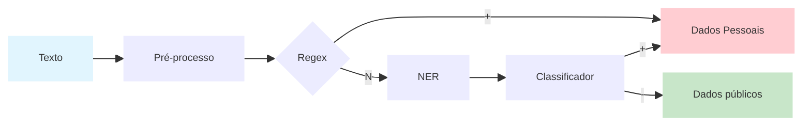
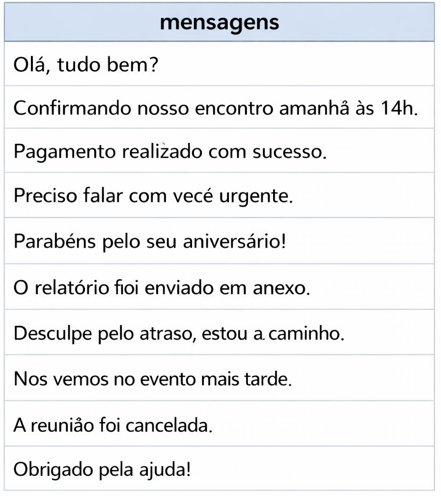
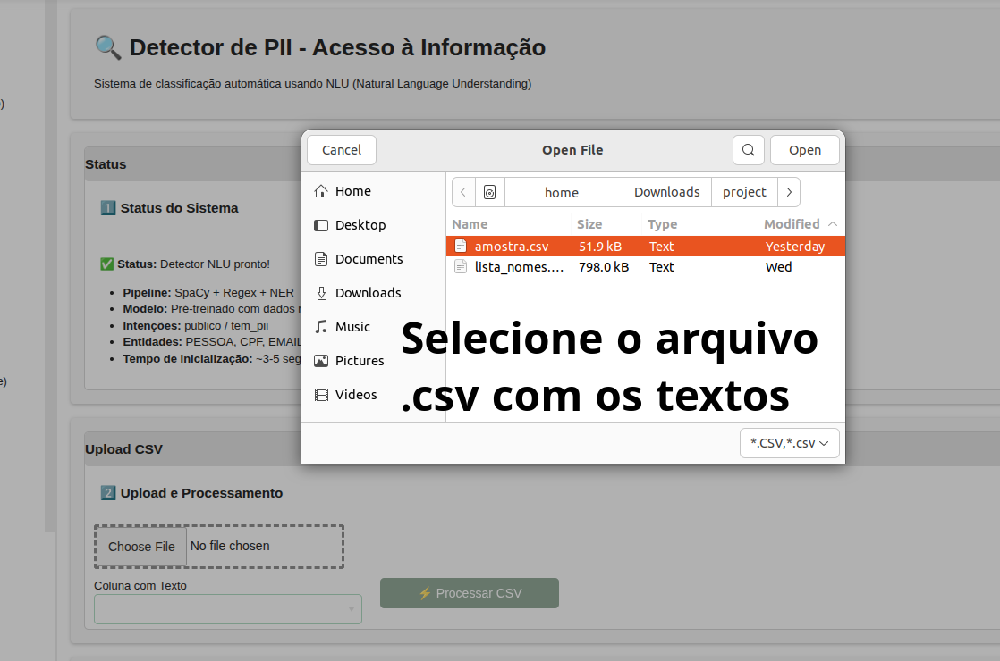
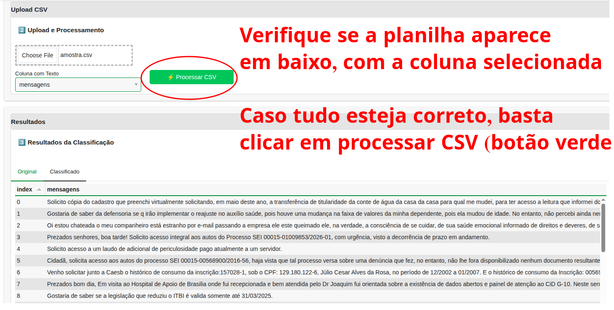
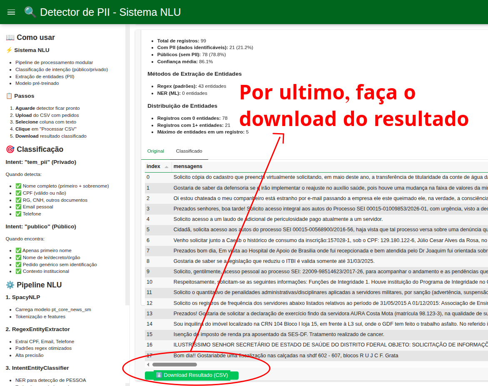

# Projeto PrivacyAware

---

## 🎯 Objetivo do projeto:

Classificar pedidos de acesso à informação em:

* **1 = contém dados pessoais**
* **0 = não contém**

Maximizando **F1-score**, com **ênfase em recall** (minimizar falsos negativos).

---

### ▶️ Video Explicativo (clicar na imagem abaixo)

[](https://youtu.be/5qS9KVnrAiI)


---
## 🎯 Objetivo do pipeline

* ✔️ Maximizar recall 
* ✔️ Simples de explicar 
* ✔️ Fácil de rodar e reproduzir
* ✔️ Não depender de LLM, GPU ou APIs externas
* ✔️ Robustez > sofisticação

---


## 🧠 Estratégia geral

**Pipeline híbrido**:

1. **Regras determinísticas (regex)** → capturam casos óbvios
2. **Modelo NER (Named Entity Recognition)** → pega padrões não explícitos
3. **OR lógico final** → se *qualquer* um detectar → classifica como positivo




## 🧰 Tutorial de Uso


---

## 🧾 1. Preparar o arquivo CSV




* O arquivo deve ter **apenas uma coluna**
* **Cada linha** deve conter **um texto a ser validado**
* A **primeira linha** deve ser o **nome da coluna** (exemplo: `mensagens`)


Exemplo conceitual:

```
mensagens
Olá, tudo bem?
Meu CPF é 123.456.789-00
Confirmando reunião amanhã
```

---

## 🌐 2. Acessar o dashboard

* Abra o navegador
* Acesse:
  **[http://localhost:8081](http://localhost:8081)**

---

## 📂 3. Carregar o arquivo CSV


* Clique no botão **“Abrir arquivos”**
* Selecione o arquivo CSV preparado anteriormente




---

## ✅ 4. Verificar a coluna de textos

* Confirme se a **coluna que contém os textos** está selecionada corretamente
* Caso exista mais de uma coluna (cenários futuros), selecione a correta

---

## ⚙️ 5. Processar o CSV


* Clique no botão **“Processar CSV”**
* Aguarde o processamento dos textos



---

## ⬇️ 6. Baixar o resultado

* Após o processamento, clique no **botão de download**
* Um **novo arquivo CSV** será gerado




---

## 📊 7. Entendendo o resultado

O arquivo gerado terá uma nova coluna chamada:

**`tem_pii`**

Valores possíveis:

* **1** → o texto contém **dados pessoais (PII)**
* **0** → o texto **não contém dados pessoais**

Isso permite validar automaticamente grandes volumes de mensagens de forma simples e reproduzível ✅
