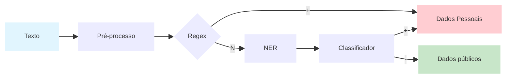

# Projeto PrivacyAware

Objetivo do projeto:

Classificar pedidos de acesso à informação em:

* **1 = contém dados pessoais**
* **0 = não contém**

Maximizando **F1-score**, com **ênfase em recall** (minimizar falsos negativos).

---
## 🎯 Objetivo do pipeline

* ✔️ Maximizar recall 
* ✔️ Simples de explicar 
* ✔️ Fácil de rodar e reproduzir
* ✔️ Não depender de LLM, GPU ou APIs externas
* ✔️ Robustez > sofisticação

---

## 🧠 Estratégia geral

**Pipeline híbrido**:

1. **Regras determinísticas (regex)** → capturam casos óbvios
2. **Modelo NER (Named Entity Recognition)** → pega padrões não explícitos
3. **OR lógico final** → se *qualquer* um detectar → classifica como positivo

```mermaid
%%{init: {
  "theme": "default",
  "themeVariables": {
    "fontSize": "10px",
    "nodePadding": "4",
    "nodeBorder": "0.5px"
  },
  "flowchart": {
    "nodeSpacing": 10,
    "rankSpacing": 30
  }
}}%%
flowchart LR
    A[Texto] --> B[Pré-processo]
    B --> C{Regex}
    C -->|+| F[Dados Pessoais]
    C -->|N| D[NER]
    D --> E[Classificador]
    E -->|+| F
    E -->|-| G[Dados públicos]
    
    style A fill:#e1f5fe
    style F fill:#ffcdd2
    style G fill:#c8e6c9

```

